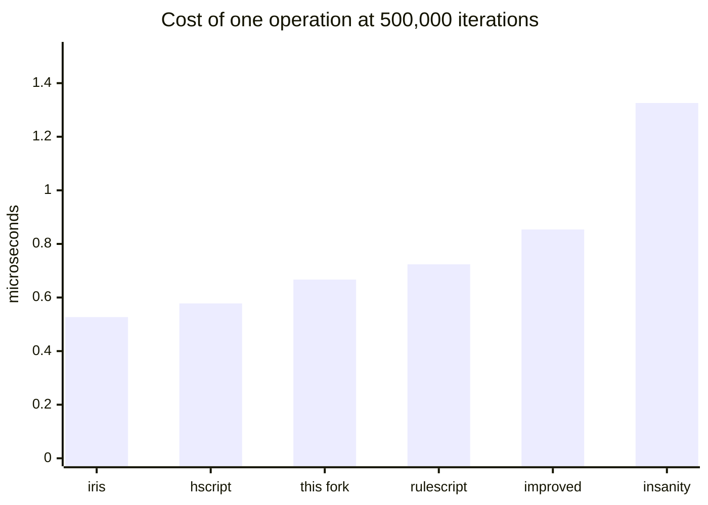

# Comparing Haxe scripting libraries

Six hscript-family libraries running identical scripts.

## Read this first: different, not better

**No library here is "the best one."** Split the suite in two and the ranking inverts: this fork is
mid-table on the cost of one ordinary operation and first by a wide margin on the cost of one
function call. Both are in the summary below, and neither is the summary on its own.

The call gap has one cause, and it is not cleverness. Every other library unwinds `return`, `break`
and `continue` by **throwing an exception**, and a thrown exception costs microseconds on a static
target. This fork signals them with flags. That is also why the corpus total flatters it: totals are
dominated by the call cases, so quote the per-operation and per-call averages instead.

`callCap20` is `call1` with twenty more variables in the enclosing scope and nothing else changed, so
the pair isolates a second design difference: whether building a call frame copies the captured
scope, and so costs something per captured variable. Four of the six pay about 30% for it. This fork
and hscript-improved pay nothing.

The same applies to features. hscript is small and fast and has no scripted classes.
hscript-improved has them and instantiates one faster than this fork does, while this fork calls
their methods several times faster -- its classes are generated bridges with real fields, theirs are
a shell over a map. RuleScript adds imports, usings and string interpolation. hscript-iris wraps a
fast interpreter in a friendlier host API. This fork and its upstream carry the largest language
surface (abstracts, modules, typedefs, properties, typed mode) and pay for it per operation.

Pick the one whose trade-off matches your workload. If you are choosing, run this suite with cases
that look like *your* scripts rather than trusting a total.

## What was measured

Every library is driven through its own public API, with the **same** script sources. Parsing is
untimed and separated from execution, so the numbers are interpreter speed rather than setup.

Every case ends in an expression whose value is known, and the harness checks it. A library that
parses and "runs" a case without doing the work is reported as `WRONG`, not as infinitely fast. That
check earned its place: it caught two mistakes in the expected values, and three genuine behavioural
differences between libraries that timings alone would have hidden.

Each case runs in its **own process**, because some libraries hang or crash on some inputs and would
otherwise take the rest of the run with them. Best of 3, hxcpp, one machine, one sitting.

### Every library is built with position tracking

hscript's `Expr` is `typedef ExprDef = Expr` unless it is built with `-D hscriptPos`: without that
define it records no source positions **at all**. hscript-improved, hscript-iris and RuleScript
inherit the same switch.

This fork cannot turn positions off, because error reporting, `posInfos` and call-stack traces depend
on them. Comparing against a build that records nothing would not be measuring the same job, so every
library in the comparison is built **with** them. What the switch costs the libraries that have it is
reported separately at the end, where it reads as the price of a feature rather than a ranking.

### Three scales

The corpus runs at 25,000, 100,000 and 500,000 iterations. One scale cannot tell a real
per-operation difference apart from a fixed setup cost or a warm-up artefact. Expected values are
derived from the iteration count, so the value checking holds at every scale.

## Results

<!-- BEGIN GENERATED: test/xbench/collate.py -->

### Every case, microseconds per iteration at 500,000

One row per case, and the only per-case table in this document. `kind` is which average the
row feeds: `op` and `call` are averaged separately because they differ by design rather than
by degree, and `unwind` cases are in neither, being dominated by how a library implements
`continue` and `throw`.

| case | kind | this fork | insanity | hscript | improved | iris | rulescript |
| --- | --- | --- | --- | --- | --- | --- | --- |
| `noCall` | op | 0.456 | 1.019 | 0.388 | 0.641 | 0.360 | 0.507 |
| `loopPlain` | op | 0.454 | 1.052 | 0.415 | 0.623 | 0.378 | 0.531 |
| `loopCont` | unwind | 0.664 | 5.303 | 4.413 | 4.752 | 4.323 | 4.841 |
| `postIncr` | op | 0.432 | 1.001 | 0.358 | 0.494 | WRONG (0) | 0.450 |
| `arith` | op | 0.647 | 1.196 | 0.531 | 0.787 | 0.467 | 0.696 |
| `locals` | op | 0.557 | 1.261 | 0.481 | 0.756 | 0.440 | 0.620 |
| `blocks` | op | 0.678 | 1.598 | 0.560 | 0.956 | 0.486 | 0.738 |
| `field` | op | 0.584 | 1.281 | 0.427 | 0.721 | 0.401 | 0.574 |
| `fieldSet` | op | 0.617 | 1.167 | 0.427 | 0.738 | 0.404 | 0.557 |
| `method` | op | 1.017 | 1.617 | 0.681 | 1.052 | 0.669 | 0.862 |
| `index` | op | 0.527 | 1.138 | 0.443 | 0.677 | 0.407 | 0.580 |
| `indexSet` | op | 0.514 | 1.084 | 0.442 | 0.699 | 0.418 | 0.567 |
| `not` | op | 0.544 | 1.164 | 0.468 | 0.708 | 0.427 | 0.616 |
| `neg` | op | 0.513 | 1.115 | 0.425 | 0.700 | 0.399 | 0.561 |
| `call0` | call | 0.843 | 9.309 | 7.731 | 8.312 | 7.588 | 8.124 |
| `call1` | call | 1.250 | 10.043 | 8.049 | 8.570 | 7.874 | 8.422 |
| `call3` | call | 1.910 | 10.754 | 8.513 | 9.097 | 8.226 | 8.981 |
| `callCap20` | call | 1.244 | 13.612 | 10.416 | 8.499 | 10.147 | 10.684 |
| `forRange` | op | 0.153 | not supported | not supported | not supported | 0.130 | not supported |
| `forArray` | op | 0.161 | 0.293 | 0.173 | 0.264 | 0.138 | 0.216 |
| `arrayDecl` | op | 0.979 | 1.764 | 0.699 | 1.115 | 0.595 | 0.904 |
| `strConcat` | op | 0.886 | 1.979 | 1.235 | 1.491 | 1.201 | 1.380 |
| `ternary` | op | 0.725 | 1.438 | 0.713 | 0.994 | 0.641 | 0.891 |
| `switch` | op | 0.825 | 1.580 | 0.727 | 0.963 | 0.634 | 0.883 |
| `tryCatch` | unwind | 8.291 | 9.715 | 7.874 | 8.183 | 7.637 | 8.416 |
| `strInterp` | op | 1.085 | 1.589 | WRONG (v$n) | WRONG (v$n) | WRONG (v$n) | 0.883 |
| `mapLiteral` | op | 1.317 | 2.112 | 1.162 | 1.483 | 1.016 | 1.355 |
| `arrayCompr` | op | 3.052 | not supported | not supported | not supported | 10.339 | not supported |
| `varTyped` | op | 0.654 | 1.005 | 0.385 | 0.616 | 0.358 | not supported |
| `fnTyped` | call | 1.710 | 10.371 | 8.066 | 8.550 | 7.836 | not supported |
| `classNew` | op | 6.907 | 110.801 | not supported | 4.608 | not supported | not supported |
| `classCall` | call | 1.523 | not supported | not supported | 8.785 | not supported | not supported |
| `classField` | op | 0.685 | 1.399 | not supported | 0.799 | not supported | not supported |

### Summary, over the 24 cases every library ran

| | this fork | insanity | hscript | improved | iris | rulescript |
| --- | --- | --- | --- | --- | --- | --- |
| us per operation (18 cases) | 0.667 | 1.326 | 0.578 | 0.854 | 0.527 | 0.724 |
| us per call (4 cases) | 1.312 | 10.930 | 8.677 | 8.620 | 8.459 | 9.053 |
| parse, ms | 0.784 | 1.16 | 0.977 | 2.754 | 0.627 | 1.145 |
| corpus total, ms | 13102 | 41299 | 28696 | 31391 | 27638 | 31252 |
| total relative to this fork | 1.00x | 3.15x | 2.19x | 2.40x | 2.11x | 2.39x |




### The ranking does not depend on the scale

The whole corpus at each scale. If a difference only showed up at one size it would be a
warm-up or fixed-setup artefact rather than a property of the interpreter.

| | this fork | insanity | hscript | improved | iris | rulescript |
| --- | --- | --- | --- | --- | --- | --- |
| us per operation, 25,000 | 0.687 | 1.369 | 0.592 | 0.868 | 0.540 | 0.741 |
| us per operation, 100,000 | 0.672 | 1.329 | 0.586 | 0.854 | 0.535 | 0.731 |
| us per operation, 500,000 | 0.667 | 1.326 | 0.578 | 0.854 | 0.527 | 0.724 |
| us per call, 25,000 | 1.327 | 10.659 | 8.611 | 8.630 | 8.511 | 9.072 |
| us per call, 100,000 | 1.312 | 10.642 | 8.542 | 8.566 | 8.464 | 9.034 |
| us per call, 500,000 | 1.312 | 10.930 | 8.677 | 8.620 | 8.459 | 9.053 |
| spread, operations | 3.1% | 3.3% | 2.4% | 1.6% | 2.6% | 2.4% |
| spread, calls | 1.1% | 2.7% | 1.6% | 0.7% | 0.6% | 0.4% |

### What position tracking costs the libraries that can switch it off

Not a ranking. This fork cannot turn positions off, so the comparison above is built
with them on everywhere; this is what that decision costs the others. At 500,000.

| | hscript | improved | iris | rulescript |
| --- | --- | --- | --- | --- |
| us per operation, with | 0.578 | 0.854 | 0.527 | 0.724 |
| us per operation, without | 0.487 | 0.786 | 0.527 | 0.598 |
| cost | 18.6% | 8.7% | 0.0% | 21.2% |
| parse with, ms | 0.977 | 2.754 | 0.627 | 1.145 |
| parse without, ms | 0.468 | 2.123 | 0.463 | 0.498 |

<!-- END GENERATED -->

## Behavioural differences found

These came out of the value checking, not the timing, and matter more than any of the numbers above
if you are choosing a library. All were reproduced directly, outside the harness.

**`for (i in 0...n)` does not work on hxcpp in hscript, hscript-improved, RuleScript or upstream
insanity.** The cause is a known hxcpp detail: `IntIterator`'s `hasNext`/`next` are `inline`, so they
have no runtime form to reflect on. This fork and hscript-iris both special-case it.

How it fails depends on whether the library was built with position tracking, which is worth knowing
because the silent form is far harder to diagnose:

```haxe
// hscript, hscript-improved, RuleScript built WITHOUT -D hscriptPos
var z = 1; for (k in 0...5) { } z = 2; z;   // -> null, no exception, rest of the program abandoned
var z = 1; for (k in [1,2]) { } z = 2; z;   // -> 2, array iteration is fine

// the same libraries built WITH -D hscriptPos
var z = 1; for (k in 0...5) { } z = 2; z;   // -> raises "Invalid iterator: IntIterator"
```

This is also the whole explanation for `arrayCompr`: `[for (k in 0...5) ...]` abandons the enclosing
block, the loop counter never advances, and the surrounding `while` spins forever, which is why the
no-position builds of those three time out and are recorded as `CRASH`. With positions on they raise
the same `IntIterator` error instead. Comprehension over an array works fine in every library.

**hscript-iris does not implement `++`.** `var i = 0; i++; i;` returns `0`, and `++i` behaves the
same; `i = i + 1` and `i += 1` both work. Any `while (i < n) { ...; i++; }` therefore never
terminates. Because of this, every loop counter in this suite uses `i += 1`, which is equally fair to
all six libraries, and the `postIncr` case exists to isolate the difference.

**RuleScript does not build against current hscript.** It needs an hscript predating
`Interp.makeKeyValueIterator` and `resolveType`; it was pinned to hscript `609c489` here. Its
`extraParams.hxml` also has to be passed by hand when using `-cp` instead of haxelib, since it patches
hscript's enums at compile time.

**Single-quote string interpolation** (`'v$n'`) is absent in hscript, hscript-improved and
hscript-iris, which return the literal text. This fork, upstream insanity and RuleScript interpolate.

## What was tested

| library | version | notes |
| --- | --- | --- |
| this fork | working tree | always tracks positions |
| [hscript-insanity](https://github.com/inky03/hscript-insanity) (upstream, "insanity") | `9b3c9f8` | always tracks positions |
| [hscript](https://github.com/HaxeFoundation/hscript) | 2.7.0 | built both ways |
| [hscript-improved](https://github.com/CodenameCrew/hscript-improved) | `48ec0f4` | built both ways |
| [hscript-iris](https://github.com/pisayesiwsi/hscript-iris) | 1.1.3 (`8867c9a`) | built both ways |
| [RuleScript](https://github.com/Kriptel/RuleScript) | `b5b377a` | built both ways; needs hscript `609c489` |

Haxe 4.3.7, hxcpp, Windows, single machine, one sitting.

## Reproducing

The harness is in [`../test/xbench`](../test/xbench). In short:

```sh
LIBS=/path/to/library/checkouts sh test/xbench/run.sh
```

`LIBS` wants checkouts named `insanity-upstream`, `hscript`, `improved`, `iris`, `rulescript` and
`hscript-rs` (the older hscript RuleScript needs). Anything missing is skipped, and the collator
drops absent libraries rather than emptying the shared-case set, so a subset produces a table for
that subset.

Scales default to `25000 100000 500000` and are settable:

```sh
SCALES="50000 200000" LIBS=... sh test/xbench/run.sh
```

They must be multiples of 1000, which is the array length `forArray` walks.

`collate.py` writes the whole of the Results section above. Paste its output between the two
`GENERATED` markers rather than editing the tables by hand: it is one table of record plus its
summaries, so a re-run replaces all of it in one go and there is nothing to keep in sync.

Every hscript-derived library is built twice, once with
[`hscript-pos.hxml`](../test/xbench/hscript-pos.hxml) and once without. Do not drop the
position-tracking builds when comparing against this fork: without that define those libraries record
no source positions at all, and this fork cannot work that way.

## Caveats

**Read the ratios, not the numbers.** Absolute microseconds drift with machine state by well over
10%, which is more than most of the differences between neighbouring libraries here. Rebuild and
re-run everything in one sitting before comparing anything, and never merge a re-run of one library
into a table measured in another sitting.

**The shared-case set excludes the cases some library cannot run**, so the totals and averages
describe a common subset and say nothing about the features that subset leaves out: `forRange` and
`arrayCompr` (the `IntIterator` issue above), `postIncr` (iris has no `++`), `strInterp` (three
libraries return the literal text), `varTyped` and `fnTyped` (RuleScript rejects type annotations),
and `classNew`/`classCall`/`classField` (only some libraries have scripted classes). Excluding them
is generous to the libraries that fail them. The per-case list is where those live.

**A micro-benchmark is not an application.** These cases isolate single operations on purpose, so
they overstate interpreter differences relative to a real script that also touches the host's own
code. Use them to understand *where* libraries differ, then measure your own workload.
