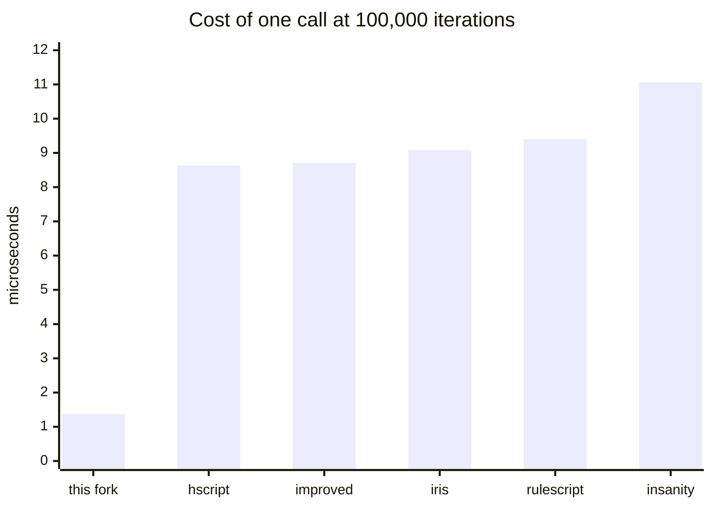

# Comparing Haxe scripting libraries

Six hscript-family libraries running identical scripts.

## Read this first: different, not better

**No library here is "the best one."** Split the suite in two and the ranking inverts: this fork is
mid-table on the cost of one ordinary operation and first by a wide margin on the cost of one
function call. Both are in the summary below, and neither is the summary on its own.

The call gap has one cause, and it is not cleverness. Every other library unwinds `return`, `break`
and `continue` by **throwing an exception**, and a thrown exception costs microseconds on a static
target. This fork signals them with flags. That is also why the corpus total flatters it: totals are
dominated by the call cases, so quote the per-operation and per-call averages instead.

`callCap20` is `call1` with twenty more variables in the enclosing scope and nothing else changed, so
the pair isolates a second design difference: whether building a call frame copies the captured
scope, and so costs something per captured variable. Four of the six pay about 30% for it. This fork
and hscript-improved pay nothing.

The same applies to features. hscript is small and fast and has no scripted classes.
hscript-improved has them and instantiates one faster than this fork does, while this fork calls
their methods several times faster -- its classes are generated bridges with real fields, theirs are
a shell over a map. RuleScript adds imports, usings and string interpolation. hscript-iris wraps a
fast interpreter in a friendlier host API. This fork and its upstream carry the largest language
surface (abstracts, modules, typedefs, properties, typed mode) and pay for it per operation.

Pick the one whose trade-off matches your workload. If you are choosing, run this suite with cases
that look like *your* scripts rather than trusting a total.

## What was measured

Every library is driven through its own public API, with the **same** script sources. Parsing is
untimed and separated from execution, so the numbers are interpreter speed rather than setup.

Every case ends in an expression whose value is known, and the harness checks it. A library that
parses and "runs" a case without doing the work is reported as `WRONG`, not as infinitely fast. That
check earned its place: it caught two mistakes in the expected values, and three genuine behavioural
differences between libraries that timings alone would have hidden.

### How a case is run

A case is a source string, an iteration count, and the value the source must evaluate to. The loop is
written **into the script**, not around it, so what is timed is the interpreter running a loop rather
than the host calling into it N times:

```haxe
// `call1`, at 100,000 iterations, expected value "7"
function f(a) return a;
var i = 0; var s = 0;
while (i < 100000) { s = f(7); i += 1; }
s;
```

Each library supplies two closures to
[`XBench.run`](../test/xbench/XBench.hx) and nothing else, so the harness never touches a library's
internals:

- **`prepare(src)`** parses and builds whatever that library needs, and is **untimed**.
- **`exec(handle)`** runs the prepared program and returns its value, and is **timed**.

Per case the harness then:

1. calls `prepare` once; if it throws or returns null the case is `not supported` for that library and
   nothing is timed
2. runs 5 reps. Each rep calls `prepare` **again**, then times `exec` alone. Re-preparing every rep
   matters for fairness: a library that mutates its program in place or caches state on the
   interpreter would otherwise look faster on reps 2-5 than one that does not
3. takes the **median** of the 5 timings
4. compares the returned value against the expected one, and records `ok` or `wrong`

Expected values are derived from the iteration count (`call1` expects `7`, `loopPlain` expects the
count itself), so the same corpus and the same checking work at any scale.

The median rather than the fastest run: best-of-N answers "how fast can this go when nothing
interferes", which flatters whichever library got the quietest slice of the machine. The median
answers "what does this usually cost", which is what a host budgeting a frame needs, and an unlucky
scheduler spike moves it no more than a lucky one does.

Each case runs in its **own process**, with a 300-second timeout, because some libraries hang or
crash outright on some inputs and would otherwise take the rest of the run down with them. Each
emits one machine-readable line:

```
R|<lib>|<case>|<tier>|<iterations>|<status>|<median ms>|<value>
```

`tier` is `core` or `ext` -- whether the case uses only constructs every library is expected to have.
It is not the `kind` column in the per-case table below, which `collate.py` derives from the case
name to decide which average the row feeds.

`collate.py` reads those lines and divides: microseconds per iteration is
`median ms x 1000 / iterations`. Nothing in the tables is a raw timing, which is why they stay
comparable across scales.

Parse throughput is measured separately, and is the only place `prepare` is timed: one 11.6KB source
of 80 small functions, median of 5, no execution.

### Built with `-dce no`, and that is a correctness setting

Under hxcpp's default `-dce std` the compiler eliminates `IntIterator.hasNext` and `next`: every call
site inlines them, so nothing references them statically. An interpreter reaching them by reflection
then finds a null field, and `for (i in 0...n)` fails -- **in the host's build, not in the library**.
Earlier versions of this page reported that as a defect in four of the six libraries. It was not.

Everything here is therefore built with `-dce no`, which measures the libraries rather than the build
settings. A probe over 83 commonly-scripted standard-library members found **42 unreachable** under
`-dce std` against 3 under `-dce no`; the catalogue is in
[`embedding.md`](embedding.md#what--dce-std-actually-removes), and it is worth reading before
concluding that any scripting library "cannot do" something.

### Every library is built with position tracking

hscript's `Expr` is `typedef ExprDef = Expr` unless it is built with `-D hscriptPos`: without that
define it records no source positions **at all**. hscript-improved, hscript-iris and RuleScript
inherit the same switch.

This fork cannot turn positions off, because error reporting, `posInfos` and call-stack traces depend
on them. Comparing against a build that records nothing would not be measuring the same job, so every
library in the comparison is built **with** them. What the switch costs the libraries that have it is
reported separately at the end, where it reads as the price of a feature rather than a ranking.

### One scale

The corpus runs at 100,000 iterations. Three scales spanning 20x were used to establish that the
ranking is a property of the interpreters rather than a warm-up or fixed-setup artefact; it held,
moving by at most a few percent, so re-establishing it on every run is not worth three times the wall
time. `SCALES="25000 100000 500000"` checks it again after a change that could plausibly disturb it.

## Results

<!-- BEGIN GENERATED: test/xbench/collate.py -->

### Every case, microseconds per iteration at 100,000

One row per case, and the only per-case table in this document. `kind` is which average the
row feeds: `op` and `call` are averaged separately because they differ by design rather than
by degree. `unwind` cases are in neither, being dominated by how a library implements
`continue` and `throw`, and nor are `compound` ones, which do far more than one operation per
iteration and would describe themselves rather than the interpreter.

<details>
<summary><strong>33 cases, click to expand</strong></summary>

| case | kind | this fork | insanity | hscript | improved | iris | rulescript |
| --- | --- | --- | --- | --- | --- | --- | --- |
| `noCall` | op | 0.484 | 1.046 | 0.391 | 0.656 | 0.373 | 0.520 |
| `loopPlain` | op | 0.510 | 1.106 | 0.429 | 0.680 | 0.406 | 0.556 |
| `loopCont` | unwind | 0.728 | 5.333 | 4.487 | 5.137 | 4.402 | 5.006 |
| `postIncr` | op | 0.474 | 1.024 | 0.378 | 0.550 | WRONG (0) | 0.481 |
| `arith` | op | 0.710 | 1.226 | 0.544 | 0.838 | 0.501 | 0.708 |
| `locals` | op | 0.587 | 1.313 | 0.492 | 0.800 | 0.467 | 0.624 |
| `blocks` | op | 0.705 | 1.634 | 0.571 | 1.012 | 0.534 | 0.798 |
| `field` | op | 0.629 | 1.313 | 0.436 | 0.761 | 0.422 | 0.618 |
| `fieldSet` | op | 0.671 | 1.204 | 0.445 | 0.786 | 0.432 | 0.575 |
| `method` | op | 1.102 | 1.721 | 0.708 | 1.094 | 0.691 | 0.951 |
| `index` | op | 0.567 | 1.156 | 0.439 | 0.713 | 0.431 | 0.633 |
| `indexSet` | op | 0.559 | 1.097 | 0.446 | 0.742 | 0.451 | 0.611 |
| `not` | op | 0.596 | 1.226 | 0.478 | 0.755 | 0.458 | 0.658 |
| `neg` | op | 0.569 | 1.166 | 0.439 | 0.739 | 0.429 | 0.596 |
| `call0` | call | 0.879 | 9.328 | 7.794 | 8.505 | 7.814 | 8.600 |
| `call1` | call | 1.316 | 10.075 | 8.012 | 8.573 | 8.461 | 8.925 |
| `call3` | call | 1.968 | 10.963 | 8.427 | 9.196 | 8.683 | 9.120 |
| `callCap20` | call | 1.318 | 13.891 | 10.276 | 8.558 | 11.362 | 10.949 |
| `forRange` | op | 0.172 | 0.300 | 0.172 | 0.268 | 0.144 | 0.214 |
| `forArray` | op | 0.186 | 0.324 | 0.187 | 0.284 | 0.158 | 0.234 |
| `arrayDecl` | op | 1.032 | 1.870 | 0.689 | 1.147 | 0.634 | 0.935 |
| `strConcat` | op | 0.941 | 2.129 | 1.255 | 1.559 | 1.264 | 1.438 |
| `ternary` | op | 0.740 | 1.461 | 0.724 | 1.008 | 0.681 | 0.911 |
| `switch` | op | 0.857 | 1.620 | 0.740 | 0.987 | 0.686 | 0.906 |
| `tryCatch` | unwind | 8.271 | 9.749 | 7.869 | 8.207 | 8.043 | 8.547 |
| `strInterp` | op | 1.169 | 1.651 | WRONG (v$n) | WRONG (v$n) | WRONG (v$n) | 0.929 |
| `mapLiteral` | op | 1.430 | 2.209 | 1.170 | 1.557 | 1.071 | 1.421 |
| `arrayCompr` | compound | 3.237 | 4.405 | 3.310 | 5.238 | 11.175 | 11.364 |
| `varTyped` | op | 0.706 | 1.071 | 0.391 | 0.673 | 0.387 | not supported |
| `fnTyped` | call | 1.797 | 10.999 | 8.052 | 8.911 | 8.348 | not supported |
| `classNew` | compound | 7.112 | 108.589 | not supported | 5.101 | not supported | not supported |
| `classCall` | call | 1.604 | not supported | not supported | 8.843 | not supported | not supported |
| `classField` | op | 0.692 | 1.445 | not supported | 0.843 | not supported | not supported |

</details>

### Summary, over the 26 cases every library ran

| | this fork | insanity | hscript | improved | iris | rulescript |
| --- | --- | --- | --- | --- | --- | --- |
| us per operation (19 cases) | 0.687 | 1.322 | 0.566 | 0.862 | 0.539 | 0.732 |
| us per call (4 cases) | 1.370 | 11.064 | 8.627 | 8.708 | 9.080 | 9.398 |
| parse, ms | 0.805 | 1.187 | 1.056 | 2.757 | 0.68 | 1.205 |
| corpus total, ms | 3076 | 8887 | 6093 | 6980 | 7017 | 7642 |
| total relative to this fork | 1.00x | 2.89x | 1.98x | 2.27x | 2.28x | 2.48x |




### How much script fits in one frame

The per-operation and per-call averages read as a budget. A 60Hz frame is 16.667ms;
the second pair is a 2ms slice of it, which is a more realistic allowance once
rendering and physics are paid for. Whole units, rounded down.

**Derived, not measured at this scale.** Timing a frame's worth of work directly is dominated
by noise -- a few hundred operations is far too short an interval to time on a preemptive OS.
These come from the 100,000-iteration averages above, which are stable, multiplied back out.
Read it the other way for a budget you already have in mind:

```
per-call us  x  calls per frame  x  60  =  us per second spent in script
```

| | this fork | insanity | hscript | improved | iris | rulescript |
| --- | --- | --- | --- | --- | --- | --- |
| operations per 60Hz frame | 24,270 | 12,605 | 29,445 | 19,323 | 30,947 | 22,771 |
| calls per 60Hz frame | 12,163 | 1,506 | 1,931 | 1,913 | 1,835 | 1,773 |
| operations per 2ms slice | 2,912 | 1,512 | 3,533 | 2,318 | 3,713 | 2,732 |
| calls per 2ms slice | 1,459 | 180 | 231 | 229 | 220 | 212 |

### What position tracking costs the libraries that can switch it off

Not a ranking. This fork cannot turn positions off, so the comparison above is built
with them on everywhere; this is what that decision costs the others. At 100,000.

| | hscript | improved | iris | rulescript |
| --- | --- | --- | --- | --- |
| us per operation, with | 0.566 | 0.862 | 0.539 | 0.732 |
| us per operation, without | 0.498 | 0.774 | 0.534 | 0.613 |
| cost | 13.6% | 11.5% | 0.9% | 19.4% |
| parse with, ms | 1.056 | 2.757 | 0.68 | 1.205 |
| parse without, ms | 0.507 | 2.196 | 0.53 | 0.531 |

<!-- END GENERATED -->

## Behavioural differences found

These came out of the value checking, not the timing, and matter more than any of the numbers above
if you are choosing a library. All were reproduced directly, outside the harness.

**`for (i in 0...n)` works everywhere, and a previous version of this page said otherwise.** It was
recorded as broken on hxcpp in hscript, hscript-improved, RuleScript and upstream insanity, blamed on
`IntIterator.hasNext`/`next` being `inline` and having no runtime form. Both halves were wrong. They
have a runtime form; `-dce std` removes it because every call site inlines them, so nothing references
them. Build with `-dce no` and all six libraries run `forRange` and `arrayCompr` correctly -- the whole
`CRASH` column this page used to carry is gone, and so are the nine timeouts behind it.

Worth stating plainly because the failure looks exactly like a library defect from the outside: a
script gets `Cannot call null`, or on a build without position tracking it silently abandons the rest
of the program. Neither points at the host's own compiler flags, which is where the cause is. See
[`embedding.md`](embedding.md#what--dce-std-actually-removes) for what else DCE takes with it.

**hscript-iris does not implement `++`.** `var i = 0; i++; i;` returns `0`, and `++i` behaves the
same; `i = i + 1` and `i += 1` both work. Any `while (i < n) { ...; i++; }` therefore never
terminates. Because of this, every loop counter in this suite uses `i += 1`, which is equally fair to
all six libraries, and the `postIncr` case exists to isolate the difference.

**RuleScript does not build against current hscript.** It needs an hscript predating
`Interp.makeKeyValueIterator` and `resolveType`; it was pinned to hscript `609c489` here. Its
`extraParams.hxml` also has to be passed by hand when using `-cp` instead of haxelib, since it patches
hscript's enums at compile time.

**Single-quote string interpolation** (`'v$n'`) is absent in hscript, hscript-improved and
hscript-iris, which return the literal text. This fork, upstream insanity and RuleScript interpolate.

## What was tested

Haxe 4.3.7, hxcpp, `-dce no`, Windows, single machine, one sitting.

| library | version | notes |
| --- | --- | --- |
| this fork | working tree | always tracks positions |
| [hscript-insanity](https://github.com/inky03/hscript-insanity) (upstream, "insanity") | `9b3c9f8` | always tracks positions |
| [hscript](https://github.com/HaxeFoundation/hscript) | 2.7.0 | built both ways |
| [hscript-improved](https://github.com/CodenameCrew/hscript-improved) | `48ec0f4` | built both ways |
| [hscript-iris](https://github.com/pisayesiwsi/hscript-iris) | 1.1.3 (`8867c9a`) | built both ways |
| [RuleScript](https://github.com/Kriptel/RuleScript) | `b5b377a` | built both ways; needs hscript `609c489` |

## Reproducing

The harness is in [`../test/xbench`](../test/xbench). In short:

```sh
LIBS=/path/to/library/checkouts sh test/xbench/run.sh
```

`LIBS` wants checkouts named `insanity-upstream`, `hscript`, `improved`, `iris`, `rulescript` and
`hscript-rs` (the older hscript RuleScript needs). Anything missing is skipped, and the collator
drops absent libraries rather than emptying the shared-case set, so a subset produces a table for
that subset.

Scales default to `100000` and are settable. Passing more than one also brings back the
scale-stability table:

```sh
SCALES="25000 100000 500000" LIBS=... sh test/xbench/run.sh
```

They must be multiples of 1000, which is the array length `forArray` walks.

`DCE` defaults to `no` and should stay there; see above. `DCE=std` reproduces what a host with default
compiler flags actually gets, which is a different and also useful question.

`collate.py` writes the whole of the Results section above. Paste its output between the two
`GENERATED` markers rather than editing the tables by hand: it is one table of record plus its
summaries, so a re-run replaces all of it in one go and there is nothing to keep in sync.

Every hscript-derived library is built twice, once with
[`hscript-pos.hxml`](../test/xbench/hscript-pos.hxml) and once without. Do not drop the
position-tracking builds when comparing against this fork: without that define those libraries record
no source positions at all, and this fork cannot work that way.

## Caveats

**Read the ratios, not the numbers.** Absolute microseconds drift with machine state by well over
10%, which is more than most of the differences between neighbouring libraries here. Rebuild and
re-run everything in one sitting before comparing anything, and never merge a re-run of one library
into a table measured in another sitting.

**The noise floor of this suite is about 5%.** Running the whole thing twice on the same machine,
median of 5 at 100,000 iterations, moved the per-operation averages by at most 2.4% and the per-call
averages by at most 5.0% (hscript-iris; every other library stayed inside 2.4%). Rankings and ratios
did not change. So treat a gap under roughly 5% as unresolved by this suite rather than as a
difference, and re-run before believing one.

**The shared-case set excludes the cases some library cannot run**, so the totals and averages
describe a common subset and say nothing about the features that subset leaves out: `postIncr` (iris
has no `++`), `strInterp` (three libraries return the literal text), `varTyped` and `fnTyped`
(RuleScript rejects type annotations), and `classNew`/`classCall`/`classField` (only some libraries
have scripted classes). Excluding them is generous to the libraries that fail them. The per-case list
is where those live.

**`arrayCompr` and `classNew` are excluded from the averages too**, for a different reason: they do
far more than one operation per iteration, so a mean including them describes the outlier. Leaving
`arrayCompr` in moved hscript-iris's per-operation figure from 0.53us to 1.02us on this run, which
would have reported it as twice as slow as it is.

**A micro-benchmark is not an application.** These cases isolate single operations on purpose, so
they overstate interpreter differences relative to a real script that also touches the host's own
code. Use them to understand *where* libraries differ, then measure your own workload.
