# Comparing Haxe scripting libraries

A measured comparison of six hscript-family libraries running identical scripts.

## Read this first: different, not better

**No library here is "the best one."** They are built for different jobs, and the numbers below show
that plainly rather than crowning a winner.

The clearest example is in this very data. Split the suite in two and the ranking inverts:

| | this fork | best of the rest | worst of the rest |
| --- | --- | --- | --- |
| cost of **one operation** | 0.655 us | **0.545 us** (iris) | 1.325 us (insanity) |
| cost of **one function call** | **1.391 us** | 8.467 us (hscript) | 10.143 us (insanity) |


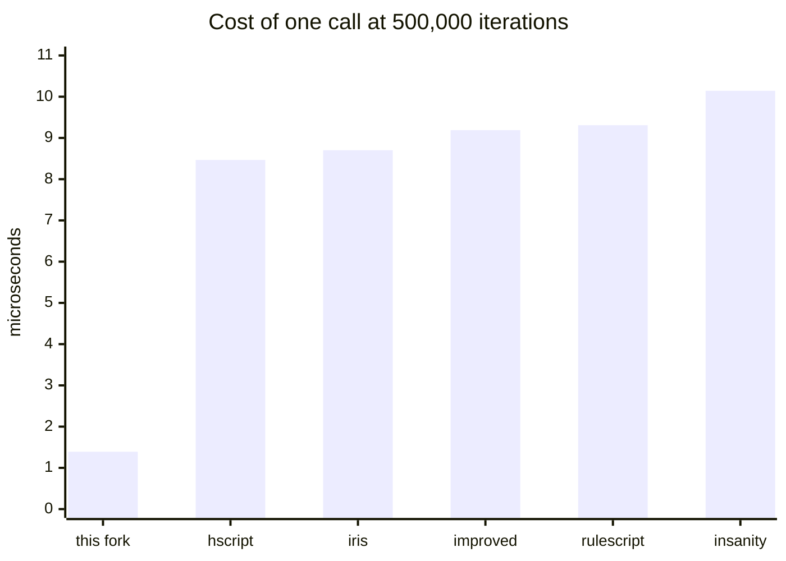

**Six times faster per call**, and it is not close.

The argument counts show why. This fork's per-call cost tracks them plainly -- 0.887us at zero
arguments, 1.312us at one, 1.974us at three -- because with the unwind cost gone, binding arguments
is what is left to measure. Every other library sits between 7.7us and 10.9us whatever the argument
count, because the thrown exception swamps the difference entirely.

This fork takes about **20% longer** per ordinary operation than the fastest library here, and runs
function calls in **a sixth** of the time the fastest of the others manages. Neither number is the
truth on its own. Which one matters depends entirely on what your scripts do: a script that grinds
arithmetic in a loop wants hscript or iris, a script that calls functions every frame wants this one.

The call gap has one cause, and it is not cleverness: every other library unwinds `return`, `break`
and `continue` by **throwing an exception**, and a thrown exception costs microseconds on a static
target. This fork signals them with flags instead.

The same reasoning applies to features. hscript is small and fast and has no scripted classes.
hscript-improved has them, and **instantiates one in half the time this fork takes** (4.698us against
9.828us), though this fork calls their methods six times faster. RuleScript adds imports, usings and
string interpolation. hscript-iris wraps a fast interpreter in a friendlier host API. This fork and
its upstream carry the largest language surface (abstracts, modules, typedefs, properties, typed
mode) and pay for it in per-operation cost.

Pick the one whose trade-off matches your workload. If you are choosing, run this suite with cases
that look like *your* scripts rather than trusting a total.

## What was measured

Every library is driven through its own public API, with the **same** script sources. Parsing is
untimed and separated from execution, so the numbers are interpreter speed rather than setup.

Every case ends in an expression whose value is known, and the harness checks it. A library that
parses and "runs" a case without doing the work is reported as `WRONG`, not as infinitely fast. That
check earned its place: it caught two mistakes in the expected values, and three genuine behavioural
differences between libraries that timings alone would have hidden.

Each case runs in its **own process**, because some libraries hang or crash on some inputs and would
otherwise take the rest of the run with them. Best of 3, hxcpp, one machine, one sitting.

### Every library tracks source positions

hscript's `Expr` is `typedef ExprDef = Expr` unless it is built with `-D hscriptPos`: without that
define it records no source positions **at all**, and its token pushback holds bare tokens rather
than `{min, max, t}`. hscript-improved, hscript-iris and RuleScript inherit the same switch.

This fork cannot turn positions off, because error reporting, `posInfos` and call-stack traces depend
on them. Comparing against a build that records nothing would not be measuring the same job, so every
library here is built **with** position tracking. The builds without it are at the
[bottom of this page](#the-same-libraries-without-position-tracking), where they can be read as the
cost of the feature rather than mistaken for the comparison.

### Three scales, not one

The whole corpus runs at 25,000, 100,000 and 500,000 iterations. One scale cannot tell a real
per-operation difference apart from a fixed setup cost or a warm-up artefact, and a result that only
appears at one size is not a property of the interpreter. Expected values are derived from the
iteration count, so the value checking holds at every scale.

The answer, below, is that the ranking is stable. No library changes position at any scale, and the
cost itself moves by at most 4.8% per operation and 7.9% per call across a 20x change in iteration
count -- with the larger movements belonging to the libraries whose call cost is dominated by
exception unwinding, which is the part most sensitive to how much garbage the run has produced.

## Results

Reported as **microseconds per iteration** rather than as totals, because the cost of one operation
is what a host budgets a frame with.

Charts plot one series each, because Mermaid's `xychart-beta` has no legend and a six-series chart
would be unreadable without one. That is also why the per-case tables further down have no chart: one
series means one library, which would show nothing the six-library table does not already show.

### Totals, per scale

A total answers a different question: not "what does one operation cost" but "how long does this
whole corpus take". It is **dominated by the call cases**, where one design difference is worth six
times, so read it next to the per-operation average rather than instead of it.

#### Total over the shared cases (ms)

| iterations | cases | this fork | insanity | hscript | improved | iris | rulescript |
| --- | --- | --- | --- | --- | --- | --- | --- |
| 25,000 | 23 | 630 | 1741 | 1198 | 1386 | 1167 | 1344 |
| 100,000 | 23 | 2512 | 6820 | 4784 | 5570 | 4714 | 5241 |
| 500,000 | 23 | 12324 | 34845 | 24356 | 28369 | 24177 | 27576 |

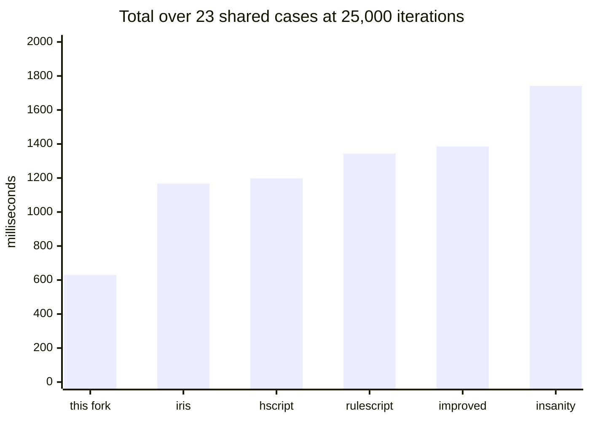

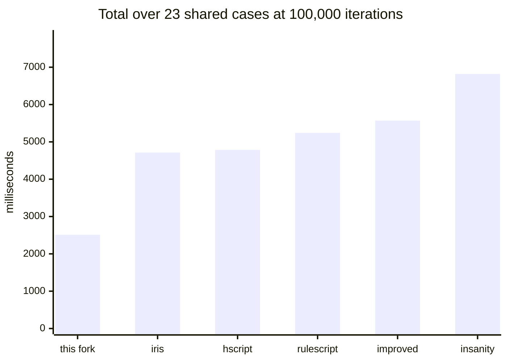

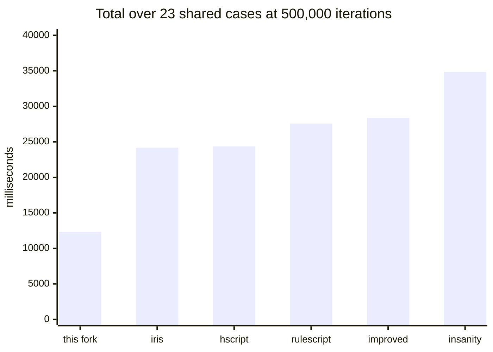

Relative to this fork:

| iterations | this fork | insanity | hscript | improved | iris | rulescript |
| --- | --- | --- | --- | --- | --- | --- |
| 25,000 | 1.00x | 2.76x | 1.90x | 2.20x | 1.85x | 2.13x |
| 100,000 | 1.00x | 2.72x | 1.90x | 2.22x | 1.88x | 2.09x |
| 500,000 | 1.00x | 2.83x | 1.98x | 2.30x | 1.96x | 2.24x |

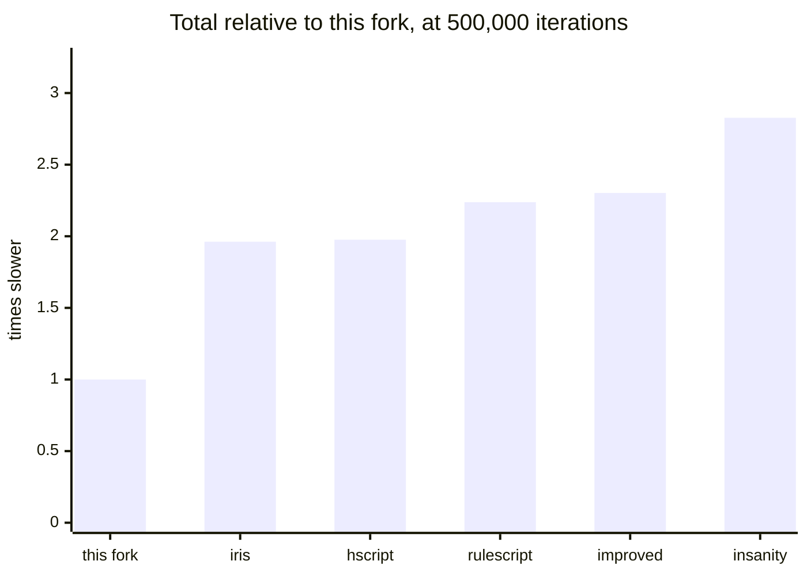

### Parse throughput, one 11.6KB source

Parsing, not interpreter setup, is what loading a script costs. The chart shows the six
position-tracking builds; the table has the others too, and they are charted at the bottom.

Among builds doing the same job, this fork is second only to iris, and parses **17% faster than
hscript**. Against hscript recording no positions at all it is 1.63x slower, which is the price of
the feature rather than a defect -- position tracking costs hscript itself 97% here.

#### All builds (ms)

| this fork | insanity | hscript | improved | iris | rulescript | hscript no-pos | improved no-pos | iris no-pos | rulescript no-pos |
| --- | --- | --- | --- | --- | --- | --- | --- | --- | --- |
| 0.819 | 1.262 | 0.985 | 2.83 | 0.682 | 1.173 | 0.501 | 2.125 | 0.502 | 0.514 |

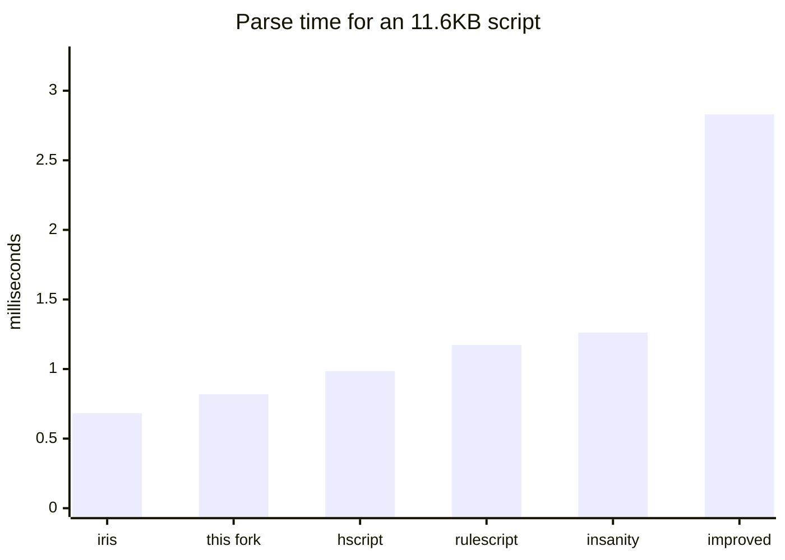

### The ranking holds across scale

#### Per-operation average (us)

| iterations | this fork | insanity | hscript | improved | iris | rulescript |
| --- | --- | --- | --- | --- | --- | --- |
| 25,000 | 0.675 | 1.389 | 0.603 | 0.890 | 0.556 | 0.747 |
| 100,000 | 0.669 | 1.330 | 0.598 | 0.879 | 0.556 | 0.727 |
| 500,000 | 0.655 | 1.325 | 0.586 | 0.870 | 0.545 | 0.726 |

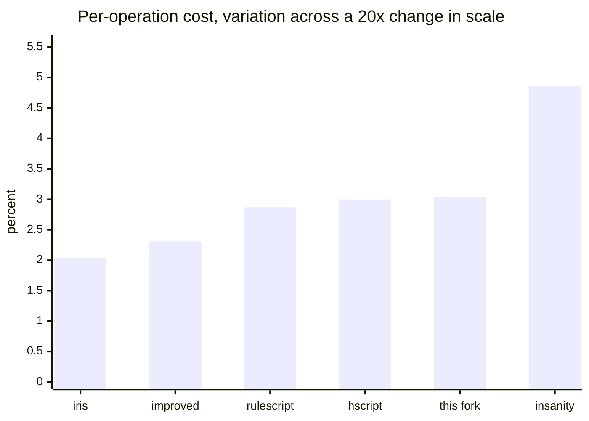

#### Per-call average (us)

| iterations | this fork | insanity | hscript | improved | iris | rulescript |
| --- | --- | --- | --- | --- | --- | --- |
| 25,000 | 1.428 | 9.876 | 8.221 | 8.698 | 8.130 | 8.865 |
| 100,000 | 1.412 | 9.792 | 8.204 | 8.849 | 8.226 | 8.624 |
| 500,000 | 1.391 | 10.143 | 8.467 | 9.190 | 8.702 | 9.308 |

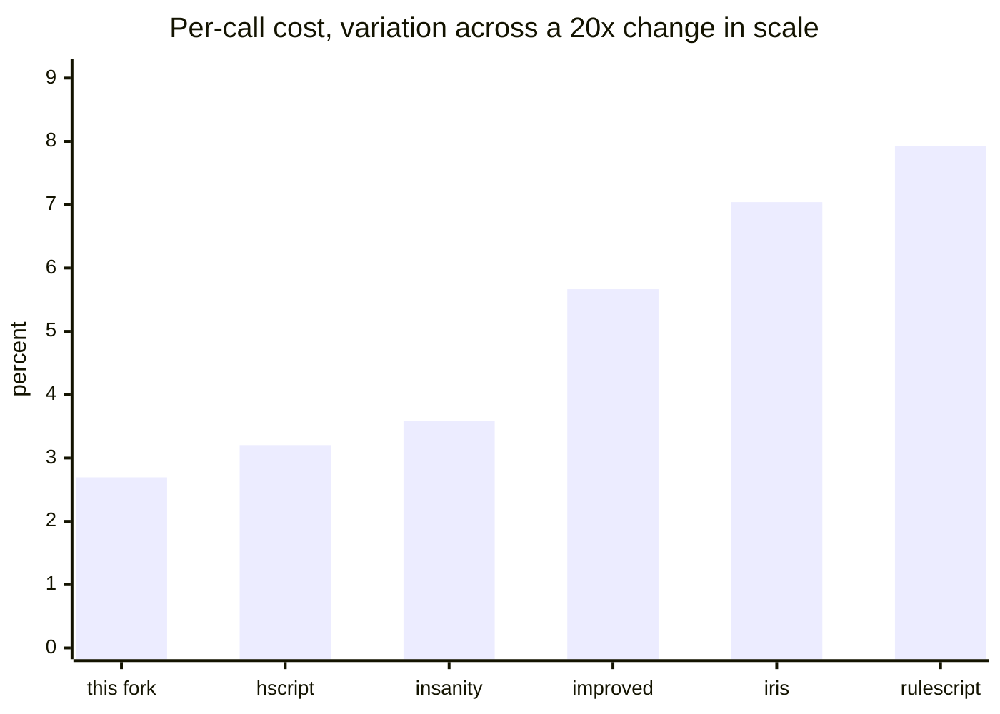

No library changes position at any scale. The cost itself moves by at most 4.8% per operation and
7.9% per call across a 20x change in iteration count, and the larger movements belong to the
libraries whose call cost is dominated by exception unwinding -- the part most sensitive to how much
garbage the run has produced. Nothing here is a warm-up or fixed-setup artefact.

## Full results

Microseconds per iteration, best of 3, lower is better. `not supported` means the library could not
parse or run the case at all; `CRASH` means the process was killed after 300 seconds.

### 25,000 iterations


#### Core cases, microseconds per iteration

| case | this fork | insanity | hscript | improved | iris | rulescript |
| --- | --- | --- | --- | --- | --- | --- |
| `noCall` | 0.448 | 1.046 | 0.392 | 0.644 | 0.384 | 0.516 |
| `loopPlain` | 0.476 | 1.095 | 0.427 | 0.660 | 0.407 | 0.550 |
| `loopCont` | 0.692 | 5.421 | 4.464 | 4.897 | 4.409 | 5.107 |
| `postIncr` | 0.427 | 1.059 | 0.375 | 0.548 | WRONG (0) | 0.463 |
| `arith` | 0.642 | 1.276 | 0.560 | 0.845 | 0.502 | 0.722 |
| `locals` | 0.583 | 1.289 | 0.496 | 0.801 | 0.452 | 0.644 |
| `blocks` | 0.670 | 1.642 | 0.581 | 1.001 | 0.526 | 0.736 |
| `field` | 0.583 | 1.305 | 0.435 | 0.753 | 0.421 | 0.600 |
| `fieldSet` | 0.608 | 1.206 | 0.434 | 0.779 | 0.422 | 0.581 |
| `method` | 1.012 | 1.687 | 0.698 | 1.107 | 0.698 | 0.874 |
| `index` | 0.514 | 1.162 | 0.445 | 0.695 | 0.427 | 0.603 |
| `indexSet` | 0.532 | 1.106 | 0.450 | 0.739 | 0.435 | 0.580 |
| `not` | 0.534 | 1.214 | 0.481 | 0.737 | 0.450 | 0.642 |
| `neg` | 0.526 | 1.185 | 0.441 | 0.710 | 0.419 | 0.575 |
| `call0` | 0.927 | 9.423 | 7.858 | 8.190 | 7.802 | 8.671 |
| `call1` | 1.402 | 9.665 | 8.187 | 8.640 | 8.068 | 8.721 |
| `call3` | 1.955 | 10.540 | 8.619 | 9.264 | 8.520 | 9.202 |
| `forRange` | 0.173 | not supported | not supported | not supported | 0.143 | not supported |
| `forArray` | 0.217 | 0.399 | 0.225 | 0.329 | 0.171 | 0.275 |
| `arrayDecl` | 0.987 | 1.881 | 0.763 | 1.157 | 0.609 | 0.935 |
| `strConcat` | 0.917 | 2.093 | 1.348 | 1.558 | 1.264 | 1.424 |
| `ternary` | 0.732 | 1.535 | 0.731 | 1.020 | 0.661 | 0.892 |

#### Extended cases, microseconds per iteration

| case | this fork | insanity | hscript | improved | iris | rulescript |
| --- | --- | --- | --- | --- | --- | --- |
| `switch` | 0.800 | 1.666 | 0.745 | 0.994 | 0.679 | 0.883 |
| `tryCatch` | 8.080 | 9.601 | 7.925 | 8.444 | 7.883 | 8.626 |
| `strInterp` | 1.099 | 1.615 | WRONG (v$n) | WRONG (v$n) | WRONG (v$n) | 0.871 |
| `mapLiteral` | 1.372 | 2.217 | 1.210 | 1.493 | 1.076 | 1.405 |
| `arrayCompr` | 2.995 | not supported | not supported | not supported | 10.539 | not supported |
| `varTyped` | 0.647 | 1.038 | 0.396 | 0.625 | 0.380 | not supported |
| `fnTyped` | 1.842 | 10.191 | 8.307 | 8.692 | 8.273 | not supported |
| `classNew` | 10.188 | 105.674 | not supported | 4.638 | not supported | not supported |
| `classCall` | 1.531 | not supported | not supported | 8.902 | not supported | not supported |
| `classField` | 0.700 | 1.442 | not supported | 0.849 | not supported | not supported |

#### Averages over the 18 operation and 3 call cases every library ran

| | this fork | insanity | hscript | improved | iris | rulescript |
| --- | --- | --- | --- | --- | --- | --- |
| us per operation | 0.675 | 1.389 | 0.603 | 0.890 | 0.556 | 0.747 |
| us per call | 1.428 | 9.876 | 8.221 | 8.698 | 8.130 | 8.865 |

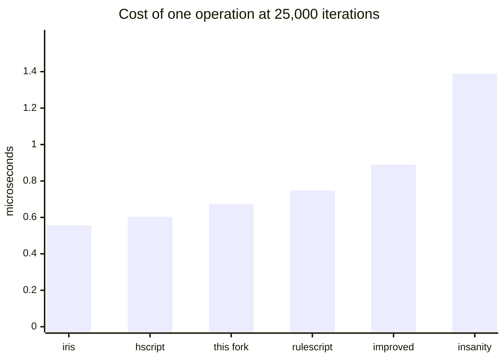

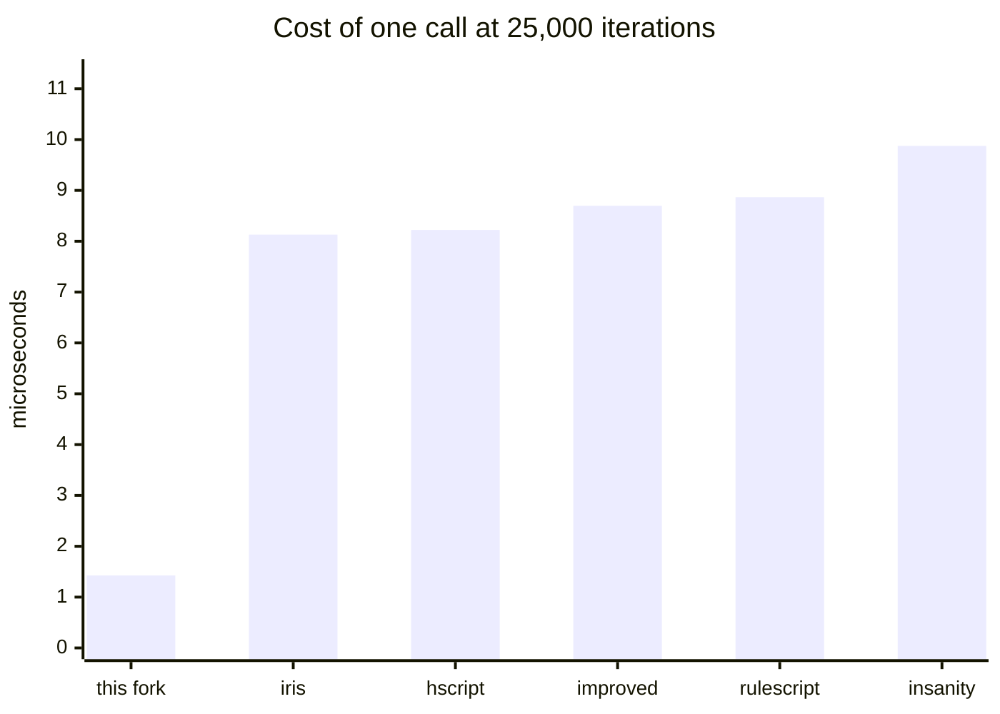

### 100,000 iterations


#### Core cases, microseconds per iteration

| case | this fork | insanity | hscript | improved | iris | rulescript |
| --- | --- | --- | --- | --- | --- | --- |
| `noCall` | 0.452 | 1.027 | 0.401 | 0.622 | 0.378 | 0.514 |
| `loopPlain` | 0.468 | 1.064 | 0.427 | 0.644 | 0.393 | 0.537 |
| `loopCont` | 0.669 | 5.316 | 4.510 | 4.880 | 4.468 | 4.968 |
| `postIncr` | 0.423 | 0.979 | 0.356 | 0.508 | WRONG (0) | 0.465 |
| `arith` | 0.657 | 1.216 | 0.547 | 0.806 | 0.493 | 0.708 |
| `locals` | 0.571 | 1.242 | 0.516 | 0.784 | 0.466 | 0.621 |
| `blocks` | 0.676 | 1.560 | 0.584 | 0.965 | 0.525 | 0.742 |
| `field` | 0.581 | 1.246 | 0.445 | 0.753 | 0.427 | 0.584 |
| `fieldSet` | 0.617 | 1.167 | 0.441 | 0.776 | 0.429 | 0.569 |
| `method` | 1.020 | 1.615 | 0.723 | 1.128 | 0.701 | 0.883 |
| `index` | 0.515 | 1.119 | 0.455 | 0.714 | 0.427 | 0.590 |
| `indexSet` | 0.525 | 1.075 | 0.458 | 0.735 | 0.432 | 0.565 |
| `not` | 0.538 | 1.187 | 0.473 | 0.727 | 0.447 | 0.619 |
| `neg` | 0.511 | 1.103 | 0.425 | 0.704 | 0.414 | 0.560 |
| `call0` | 0.904 | 9.076 | 7.923 | 8.595 | 7.939 | 8.315 |
| `call1` | 1.347 | 9.651 | 8.133 | 8.669 | 8.154 | 8.523 |
| `call3` | 1.984 | 10.649 | 8.556 | 9.282 | 8.586 | 9.035 |
| `forRange` | 0.166 | not supported | not supported | not supported | 0.143 | not supported |
| `forArray` | 0.174 | 0.318 | 0.189 | 0.288 | 0.154 | 0.223 |
| `arrayDecl` | 0.963 | 1.776 | 0.730 | 1.148 | 0.635 | 0.867 |
| `strConcat` | 0.888 | 2.006 | 1.267 | 1.533 | 1.263 | 1.392 |
| `ternary` | 0.723 | 1.455 | 0.739 | 1.007 | 0.671 | 0.879 |

#### Extended cases, microseconds per iteration

| case | this fork | insanity | hscript | improved | iris | rulescript |
| --- | --- | --- | --- | --- | --- | --- |
| `switch` | 0.835 | 1.587 | 0.751 | 1.006 | 0.690 | 0.875 |
| `tryCatch` | 8.173 | 9.575 | 7.954 | 8.442 | 7.987 | 8.472 |
| `strInterp` | 1.103 | 1.593 | WRONG (v$n) | WRONG (v$n) | WRONG (v$n) | 0.885 |
| `mapLiteral` | 1.326 | 2.166 | 1.197 | 1.492 | 1.060 | 1.362 |
| `arrayCompr` | 3.043 | not supported | not supported | not supported | 10.845 | not supported |
| `varTyped` | 0.642 | 0.995 | 0.390 | 0.635 | 0.379 | not supported |
| `fnTyped` | 1.805 | 10.262 | 8.140 | 8.905 | 8.169 | not supported |
| `classNew` | 9.921 | 121.117 | not supported | 4.902 | not supported | not supported |
| `classCall` | 1.488 | not supported | not supported | 9.094 | not supported | not supported |
| `classField` | 0.661 | 1.408 | not supported | 0.813 | not supported | not supported |

#### Averages over the 18 operation and 3 call cases every library ran

| | this fork | insanity | hscript | improved | iris | rulescript |
| --- | --- | --- | --- | --- | --- | --- |
| us per operation | 0.669 | 1.330 | 0.598 | 0.879 | 0.556 | 0.727 |
| us per call | 1.412 | 9.792 | 8.204 | 8.849 | 8.226 | 8.624 |

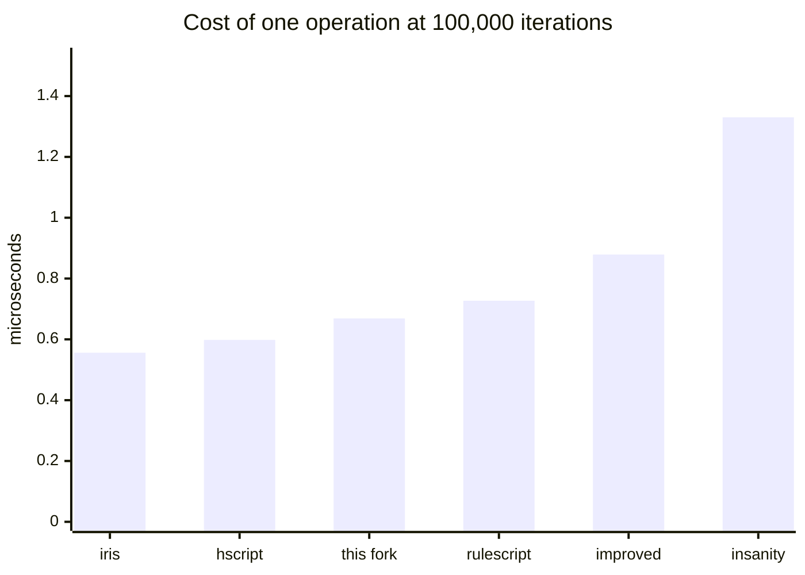

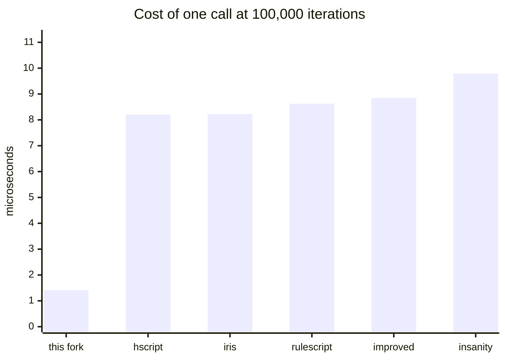

### 500,000 iterations


#### Core cases, microseconds per iteration

| case | this fork | insanity | hscript | improved | iris | rulescript |
| --- | --- | --- | --- | --- | --- | --- |
| `noCall` | 0.442 | 1.012 | 0.390 | 0.620 | 0.376 | 0.503 |
| `loopPlain` | 0.461 | 1.048 | 0.418 | 0.642 | 0.397 | 0.533 |
| `loopCont` | 0.660 | 5.259 | 4.485 | 4.912 | 4.583 | 4.926 |
| `postIncr` | 0.414 | 0.992 | 0.359 | 0.504 | WRONG (0) | 0.450 |
| `arith` | 0.628 | 1.226 | 0.533 | 0.793 | 0.488 | 0.686 |
| `locals` | 0.565 | 1.266 | 0.494 | 0.772 | 0.460 | 0.627 |
| `blocks` | 0.651 | 1.588 | 0.555 | 0.968 | 0.507 | 0.714 |
| `field` | 0.575 | 1.280 | 0.445 | 0.741 | 0.404 | 0.575 |
| `fieldSet` | 0.605 | 1.152 | 0.438 | 0.758 | 0.414 | 0.555 |
| `method` | 0.986 | 1.652 | 0.683 | 1.110 | 0.665 | 0.888 |
| `index` | 0.511 | 1.132 | 0.441 | 0.701 | 0.412 | 0.574 |
| `indexSet` | 0.506 | 1.082 | 0.445 | 0.714 | 0.429 | 0.558 |
| `not` | 0.529 | 1.151 | 0.467 | 0.714 | 0.447 | 0.619 |
| `neg` | 0.496 | 1.098 | 0.427 | 0.683 | 0.419 | 0.550 |
| `call0` | 0.887 | 9.491 | 8.220 | 8.682 | 8.296 | 8.877 |
| `call1` | 1.312 | 10.022 | 8.294 | 9.262 | 8.986 | 8.690 |
| `call3` | 1.974 | 10.915 | 8.886 | 9.627 | 8.824 | 10.359 |
| `forRange` | 0.157 | not supported | not supported | not supported | 0.137 | not supported |
| `forArray` | 0.160 | 0.296 | 0.174 | 0.266 | 0.145 | 0.213 |
| `arrayDecl` | 0.951 | 1.734 | 0.712 | 1.124 | 0.620 | 0.892 |
| `strConcat` | 0.887 | 1.993 | 1.262 | 1.542 | 1.260 | 1.411 |
| `ternary` | 0.710 | 1.431 | 0.723 | 1.003 | 0.666 | 0.898 |

#### Extended cases, microseconds per iteration

| case | this fork | insanity | hscript | improved | iris | rulescript |
| --- | --- | --- | --- | --- | --- | --- |
| `switch` | 0.798 | 1.552 | 0.739 | 0.996 | 0.644 | 0.889 |
| `tryCatch` | 8.019 | 10.155 | 8.280 | 8.595 | 7.859 | 9.239 |
| `strInterp` | 1.097 | 1.614 | WRONG (v$n) | WRONG (v$n) | WRONG (v$n) | 0.881 |
| `mapLiteral` | 1.333 | 2.155 | 1.199 | 1.512 | 1.053 | 1.378 |
| `arrayCompr` | 2.953 | not supported | not supported | not supported | 11.489 | not supported |
| `varTyped` | 0.631 | 0.995 | 0.385 | 0.635 | 0.375 | not supported |
| `fnTyped` | 1.743 | 10.625 | 8.252 | 9.277 | 8.498 | not supported |
| `classNew` | 9.828 | 128.608 | not supported | 4.698 | not supported | not supported |
| `classCall` | 1.499 | not supported | not supported | 9.219 | not supported | not supported |
| `classField` | 0.668 | 1.395 | not supported | 0.798 | not supported | not supported |

#### Averages over the 18 operation and 3 call cases every library ran

| | this fork | insanity | hscript | improved | iris | rulescript |
| --- | --- | --- | --- | --- | --- | --- |
| us per operation | 0.655 | 1.325 | 0.586 | 0.870 | 0.545 | 0.726 |
| us per call | 1.391 | 10.143 | 8.467 | 9.190 | 8.702 | 9.308 |


## Behavioural differences found

These came out of the value checking, not the timing, and matter more than any of the numbers above
if you are choosing a library. All were reproduced directly, outside the harness.

**`for (i in 0...n)` does not work on hxcpp in hscript, hscript-improved, RuleScript or upstream
insanity.** The cause is a known hxcpp detail: `IntIterator`'s `hasNext`/`next` are `inline`, so they
have no runtime form to reflect on. This fork and hscript-iris both special-case it.

How it fails depends on whether the library was built with position tracking, which is worth knowing
because the silent form is far harder to diagnose:

```haxe
// hscript, hscript-improved, RuleScript built WITHOUT -D hscriptPos
var z = 1; for (k in 0...5) { } z = 2; z;   // -> null, no exception, rest of the program abandoned
var z = 1; for (k in [1,2]) { } z = 2; z;   // -> 2, array iteration is fine

// the same libraries built WITH -D hscriptPos
var z = 1; for (k in 0...5) { } z = 2; z;   // -> raises "Invalid iterator: IntIterator"
```

This is also the whole explanation for `arrayCompr`: `[for (k in 0...5) ...]` abandons the enclosing
block, the loop counter never advances, and the surrounding `while` spins forever, which is why the
no-position builds of those three time out and are recorded as `CRASH`. With positions on they raise
the same `IntIterator` error instead. Comprehension over an array works fine in every library.

**hscript-iris does not implement `++`.** `var i = 0; i++; i;` returns `0`, and `++i` behaves the
same; `i = i + 1` and `i += 1` both work. Any `while (i < n) { ...; i++; }` therefore never
terminates. Because of this, every loop counter in this suite uses `i += 1`, which is equally fair to
all six libraries, and the `postIncr` case exists to isolate the difference.

**RuleScript does not build against current hscript.** It needs an hscript predating
`Interp.makeKeyValueIterator` and `resolveType`; it was pinned to hscript `609c489` here. Its
`extraParams.hxml` also has to be passed by hand when using `-cp` instead of haxelib, since it patches
hscript's enums at compile time.

**Single-quote string interpolation** (`'v$n'`) is absent in hscript, hscript-improved and
hscript-iris, which return the literal text. This fork, upstream insanity and RuleScript interpolate.

## The same libraries without position tracking

Everything above is built with source positions on, because this fork cannot work without them. This
is what the others cost when that is switched off -- the price of the feature, not a ranking.

#### Per-operation average (us)

| iterations | hscript | hscript no-pos | improved | improved no-pos | iris | iris no-pos | rulescript | rulescript no-pos |
| --- | --- | --- | --- | --- | --- | --- | --- | --- |
| 25,000 | 0.603 | 0.516 | 0.890 | 0.806 | 0.556 | 0.554 | 0.747 | 0.620 |
| 100,000 | 0.598 | 0.509 | 0.879 | 0.807 | 0.556 | 0.547 | 0.727 | 0.613 |
| 500,000 | 0.586 | 0.501 | 0.870 | 0.803 | 0.545 | 0.530 | 0.726 | 0.608 |

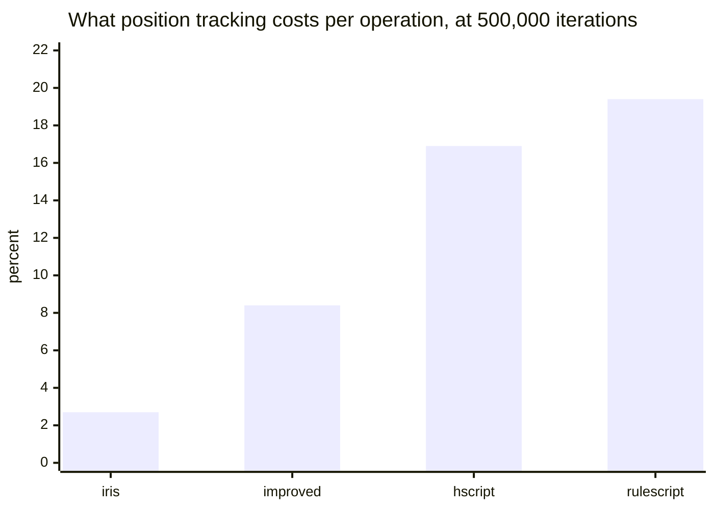

| | hscript | hscript no-pos | improved | improved no-pos | iris | iris no-pos | rulescript | rulescript no-pos |
| --- | --- | --- | --- | --- | --- | --- | --- | --- |
| parse (ms) | 0.985 | 0.501 | 2.83 | 2.125 | 0.682 | 0.502 | 1.173 | 0.514 |

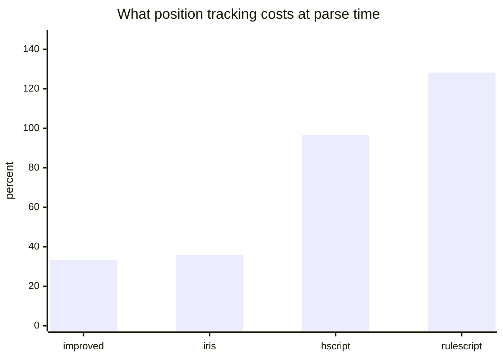

Position tracking costs between 2.7% (iris) and 19.4% (RuleScript) per operation, but between 33%
(improved) and 128% (RuleScript) at parse time. It is consistently far more expensive to parse with
than to run with, because it is an allocation per AST node against an indirection per access.

## What was tested

| library | version | notes |
| --- | --- | --- |
| this fork | working tree past `d64a3e2` | always tracks positions |
| [hscript-insanity](https://github.com/inky03/hscript-insanity) (upstream, "insanity") | `9b3c9f8` | always tracks positions |
| [hscript](https://github.com/HaxeFoundation/hscript) | 2.7.0 | built both ways |
| [hscript-improved](https://github.com/CodenameCrew/hscript-improved) | `48ec0f4` | built both ways |
| [hscript-iris](https://github.com/pisayesiwsi/hscript-iris) | 1.1.3 | built both ways |
| [RuleScript](https://github.com/Kriptel/RuleScript) | `b5b377a` | built both ways; needs hscript `609c489` |

Haxe 4.3.7, hxcpp, Windows, single machine, one sitting.

## Reproducing

The harness is in [`../test/xbench`](../test/xbench). In short:

```sh
LIBS=/path/to/library/checkouts sh test/xbench/run.sh
```

`LIBS` wants checkouts named `insanity-upstream`, `hscript`, `improved`, `iris`, `rulescript` and
`hscript-rs` (the older hscript RuleScript needs). Anything missing is skipped, and the collator
drops absent libraries rather than emptying the shared-case set, so a subset produces a table for
that subset.

Scales default to `25000 100000 500000` and are settable:

```sh
SCALES="50000 200000" LIBS=... sh test/xbench/run.sh
```

They must be multiples of 1000, which is the array length `forArray` walks.

Every hscript-derived library is built twice, once with
[`hscript-pos.hxml`](../test/xbench/hscript-pos.hxml) and once without. Do not drop the
position-tracking builds when comparing against this fork: without that define those libraries record
no source positions at all, and this fork cannot work that way.

## Caveats

Absolute microseconds drift with machine state by well over 10%, so read the **ratios**, not the
numbers. Rebuild and re-run everything in one sitting before comparing anything.

Totals are given per scale, but do not quote one on its own. They are dominated by the call cases,
where a single design difference is worth 6x, which drowns out everything else the suite measures --
the totals put this fork 1.96x to 2.83x ahead of every other library, while the per-operation average
puts it 4th of 6. Both are true, and neither is the summary.

The shared-case set is the 23 cases every library ran correctly, so it excludes nine: `forRange` and
`arrayCompr` (the `IntIterator` issue below), `postIncr` (iris has no `++`), `strInterp` (three
libraries return the literal text), `varTyped` and `fnTyped` (RuleScript does not accept type
annotations), and `classNew`, `classCall` and `classField` (only some libraries have scripted classes
at all). Excluding them is generous to the libraries that fail them, not harsh -- but it does mean
the totals and averages describe the common subset, and say nothing about the features that subset
leaves out. The per-case tables are where those live.

A micro-benchmark is not an application. These cases isolate single operations on purpose, so they
overstate interpreter differences relative to a real script that also touches the host's own code.
Use them to understand *where* libraries differ, then measure your own workload.
